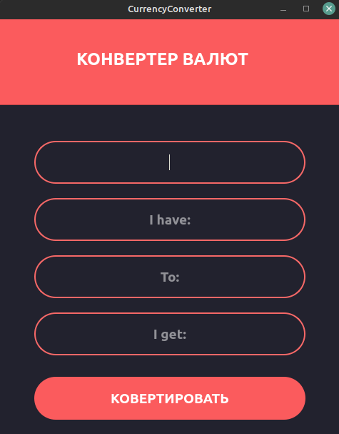

# CurrencyConverter

Это простая программа для коневертирования валюты, которую я написал ради практики навков программирования на Python и PyQt5.
Программу я создал по видео-уроку на YouTube-канале ITHobbies.

## Фотка



Не вижу смысла что-либо объяснять тут, всё интуитивно понятно.

## Технологии в проекте

CurrencyConverter - библиотека для конвертирования валют

PyQt5 - библиотека отвечающая за интерфейс

## Требования

Python версии выше 3.7.

## Недоработки

* Не поддерживаются некоторые валюты (включая Российские рубли)
* Нету удобного выбора валюты
* Пока что нету скомпилированного варианта

## Дальнейшие планы

Скоро, если у меня будет время, я хочу заменить библиотеку CurrencyConverter на что-либо другое. Причиной этому послужило то, что она не поддерживает некоторые валюты (как было сказано выше). И ещё будут исправлены недоработки. Вот и всё.

## Установка/Запуск

Для начала установите все требующиеся библиотеки.

```pip install CurrencyConverter```

```pip install PyQt5```

После того как вы установили библиотеки, перейдите в директорию проекта через терминал.

Unix/Linux:
```cd путь/до/CurrencyConverter```

Windows:
```cd "C:путь\до\CurrencyConverter"```

Запуск (на Unix/Linux будет python3):
```python main.py```

## Ссылки на ресурсы
[CurrencyConverter](https://pypi.org/project/CurrencyConverter/)

[PyQt5](https://pypi.org/project/PyQt5/)

[Канал ITH](https://www.youtube.com/c/ITHobbies)
